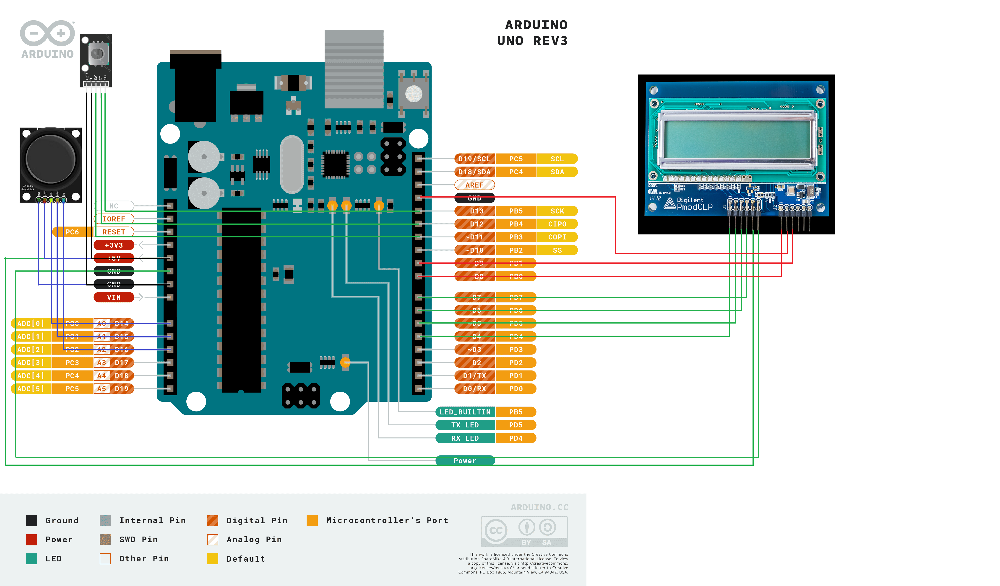

### Team members

* Petr Vaněk
* Tomáš Hadwiger

## Hardware description

We are using Arduino Uno as the platform, and the connected devices are an analog joy-stick, rotary encoder, and, as the display a Digilent PmodCLP LCD module. The schematic is shown lower.

Jako platformu používáme Arduino Uno, ovládacími prvky jsou analogový joy-stick a rotační enkodér. Jako output používáme displej Digilent PmodCLP LCD moduel.

## Software description

Using the joystick, the user can choose one of the 5 passwords he wants to remind himself of (credit card, email, etc.). 
With the rotary encoder, the user can edit the password – increment the value by turning it one way, or decrement it by turning it the other way.

S pomocí joysticku je možné zvolit požadované číselné heslo, které LCD displej vypíše. Je možné si vybrat jedno z 5 možností – PIN, emai, phone, job a notebook. 
S pomocí enkodéru je možné heslo editovat. Otočením enkodéru na jednu stranu heslo inkrementuje o 1, otočením na druhou dekrementuje o 1.

## Images

